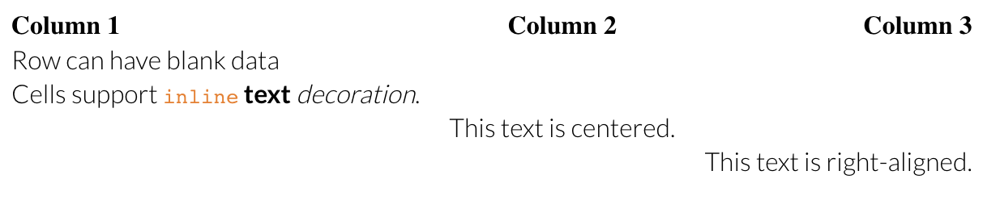
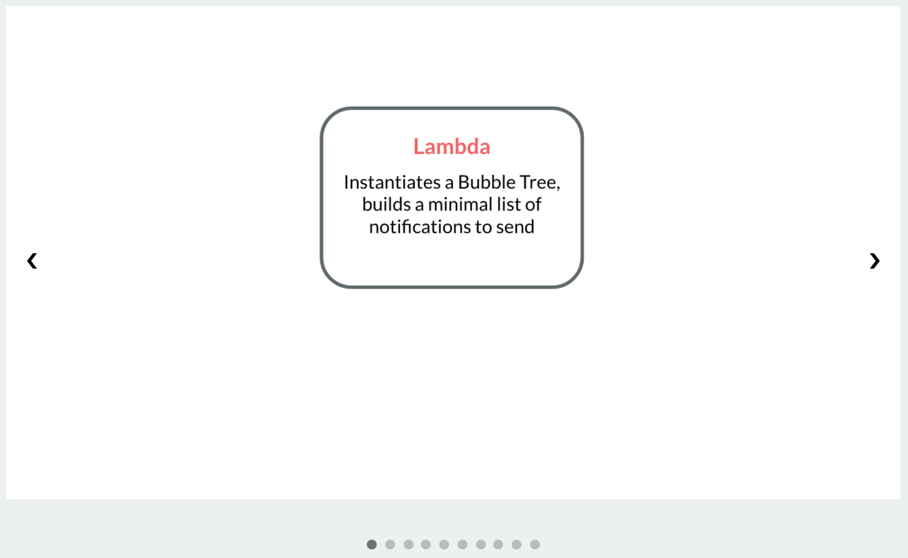

<p align="center"></p>

<h1 align="center">marq</h1>
<h5 align="center">a powerful, lightweight, and enhanced markdown to HTML converter</h5>

## Welcome to marq
Marq is a powerful, lightweight, and enhanced markdown to HTML converter. It supports a version of [GFM](https://github.github.com/gfm/) with a few additions and changes.

### Install
Install marq with [yarn](https://yarnpkg.com/) or [npm](https://www.npmjs.com/).
```bash
yarn add @wcarhart/marq
```
```bash
npm install @wcarhart/marq
```
To use marq, import it.
```javascript
const { Marq } = require('@wcarhart/marq')
```

### Usage
To use marq, first instatiate a new `Marq` object. Then, simply pass in your markdown that you'd like to convert with `convertSync()`.
```javascript
let markdown = '# This is a title\nThis is some paragraph text.\nHere is a list:\n* item 1\n* item 2\n* item 3\n'
let marq = new Marq()
let html = marq.convertSync(markdown)
console.log(html)
```
```
<h1 class="marq-h1">This is a title</h1><p class="marq-p">This is some paragraph text.</p><p class="marq-p">Here is a list:</p><ul class="marq-ul"><li class="marq-li">item 1</li><li class="marq-li">item 2</li><li class="marq-li">item 3</li></ul>
```
Or, use marq asynchronously with `convert()`.
```javascript
const generateMarkdown = async (md) => {
    let marq = new Marq()
    try {
        let html = await marq.convert(md)
    } catch (e) {
        console.error(e)
    }
}
```
Marq prefixes all built HTML classes with `marq-` so it's easy for you to target in your CSS. Don't like that? Reconfigure it yourself.
```javascript
let marq = new Marq({
    cssPrefix: 'generated-markdown-',
    cssSuffix: '-from-marq'
})
let html = marq.convertSync('# My Cool Title')
console.log(html)
```
```
<h1 class="generated-markdown-h1-from-marq">My Cool Title</h1>
```
Add separate classes and IDs with ease.
```javascript
let marq = new Marq()
let html = marq.convertSync('# My Cool Title', {cls: ['my-cool-class', 'another-class'], id: 'my-id'})
console.log(html)
```
```
<h1 class="marq-h1 my-cool-class another-class" id="my-id">My Cool Title</h1>
```
For more intense markdown generation, include a page name for error messages and better traceability.
```javascript
let marq = new Marq()
let html = marq.convertSync('|Column Name|\n|-|\n|data|', {page: 'mypage.html'})
```
```
Error: Invalid markdown: unclosed table in 'mypage.html', did you forget to end the table with an empty newline?
```
Use marq with files.
```javascript
const fs = require('fs')
fs.writeFileSync('my_webpage.html', marq.convertSync(fs.readFileSync('my_markdown.md').toString()))
```
And much, much more.

### Examples
A preliminary CSS and JS files are provided to showcase some styling options, but most of styling is left to the author. For real life examples of marq's capabilities, check out my [personal website](https://willcarh.art), [willcarh.art](https://github.com/wcarhart/willcarh.art), which uses marq for all its markdown generation.

### Markdown Options and Documentation
Marq supports a wide variety of markdown structures, initially inspired by [GFM](https://github.github.com/gfm/) (_note: most GFM .md files will work with marq_). Keep in mind that these examples are HTML structures only (see the `css/` and `js/` directories for some styling samples).

#### Titles
Titles `h1` through `h6` start with a `#`.
```
# This is an h1
### This is an h3
###### This is an h6
```
```html
<h1 class="marq-h1">This is an h1</h1>
<h3 class="marq-h3">This is an h3</h3>
<h6 class="marq-h6">This is an h6</h6>
```

#### Shoutouts
Shoutouts are an addition to [GFM](https://github.github.com/gfm) and are a cool way to call attention to something in an article or blog post.
```
>> Help! | Can you please help me by subscribing to my new email list? It would be much appreciated!
```
```html
<div class="marq-shoutout">
    <p class="marq-shoutout-title"><b>Help!</b></p>
    <p class="marq-shoutout-text">Can you please help me by subscribing to my new email list? It would be much appreciated!</p>
</div>
```

#### Paragraph Text
Regular text is rendered as paragraph `<p>` text. One notable difference is consecutive newlines not separated by a line break are not concatenated to the same line, which is different from [GFM](https://github.github.com/gfm).
```
Here is some text.
Here is some more text, not on the same line.
```
```html
<p class="marq-p">Here is some text.</p>
<p class="marq-p">Here is some more text, not on the same line.</p>
```

#### Inline text decoration
Inline text decoration includes `inline code`, **bold text**, _italicized text_, and ~~strikethrough~~. You can combine each of these together on one line, too.
```
This text is `inline code`.
This text is **bold**.
This text is _italicized_.
This text is ~~struck through~~.
Here is some **bold and _italicized_ text**.
```
```html
<p class="marq-p">This text is <code class="marq-inline-code">inline code</code>.</p>
<p class="marq-p">This text is <b class="marq-bold-text">bold</b>.</p>
<p class="marq-p">This text is <i>italicized</i>.</p>
<p class="marq-p">This text is <s>struck through</s>.</p>
<p class="marq-p">Here is some <b class="marq-bold-text">bold and <i>italicized</i> text</b>.</p>
```

#### Unordered Lists
Unordered lists start with `* ` and must be followed by an empty new line.  _Note: nested lists are not currently supported._
```
This week's groceries:
* bananas
* Goldfish crackers
* chicken breasts

```
```html
<p class="marq-p">This week's groceries:</p>
<ul class="marq-ul">
    <li class="marq-li">bananas</li>
    <li class="marq-li">Goldfish crackers</li>
    <li class="marq-li">chicken breasts</li>
</ul>
```

#### Ordered Lists
Ordered lists start with a number and must be followed by an empty new line. The list can start with any integer. _Note: nested lists are not currently supported._
```
Chores, continued from last week:
2. Mow lawn
3. Take out garbage
4. Change car oil

```
```html
<p class="marq-p">Chores, continued from last week:</p>
<ol class="marq-ol" start=2>
    <li class="marq-li"><span class="marq-span">Mow lawn</span></li>
    <li class="marq-li"><span class="marq-span">Take out garbage</span></li>
    <li class="marq-li"><span class="marq-span">Change car oil</span></li>
</ol>
```

#### Links
Links consist of a URL and some link text.
```
Check out my cool website: [willcarh.art](https://willcarh.art)
```
```html
<p class="marq-p">Check out my cool website: <a class="marq-link" href="https://willcarh.art" target="_blank">willcarh.art</a></p>
```

#### Images
Images are the same as links, except they start with a `!`. They can also contain a caption.
```

<Here's a cool picture of me on vacation>
```
```html
<p class="marq-img-subtitle"></p>
<p class="marq-img-subtitle">Here's a cool picture of me on vacation</p>
```

#### Inline HTML
You can use HTML blocks between `===` to render actual HTML and inline JavaScript instead of markdown-generated HTML.
```
===
<script>
    let span = document.getElementById('myspan')
    span.innerText = 'dynamic text'
</script>
===
This is some static text.
===
<p>This is some <span id="myspan"></span>.</p>
===
```
```html
<script>
    let span = document.getElementById('myspan')
    span.innerText = 'dynamic text'
</script>
<p class="marq-p">This is some static text.</p>
<p>This is some <span id="myspan"></span>.</p>
```

#### Code Blocks
You can render preformatted code between `` ``` `` blocks. You can specify a language for automatic syntax highlighting in the browser via [Highlight.js](https://github.com/highlightjs/highlight.js/). Marq also specs out a blank image in case you want to add a copy button to the code block later.
````
```python
def say_hello():
    print('hello')
```
````
```html
<pre class="marq-code-container">
    
    <code class="language-python marq-block-code">
    def say_hello():
        print("hello")
    </code>
</pre>
```

#### Blockquotes
Blockquotes are an HTML structure used to indicate that a longer portion of text is quoted from another source. Start a line with `>` to utilize them with marq.
```
> www.google.com | This is a blockquote with an optional source to cite.
> This is a blockquote without a source.
```
```html
<blockquote cite="www.google.com" class="marq-blockquote">This is a blockquote with an optional source to cite.</blockquote>
<blockquote class="marq-blockquote">This is a blockquote without a source.</blockquote>
```

#### Comments
Ever wanted to leave comments in your markdown? Now you can, by starting the line with a `?`.
```
Here is some content.
? Here is a comment
Here is some more content.
```
```html
<p class="marq-p">Here is some content.</p>
<p class="marq-p">Here is some more content.</p>
```

#### Embedded YouTube Videos
Similar to embedded images, marq supports embedded YouTube videos with minimal YouTube branding. Add a line with `~()` and pass in the YouTube video's 11 character ID.
```
See our product in action below:
~(dQw4w9WgXcQ)
```
```html
<p class="marq-p">See our product in action below:</p>
<iframe class="marq-youtube-embedded" src="https://www.youtube.com/embed/dQw4w9WgXcQ?playlist=dQw4w9WgXcQ&mute=1&rel=0&modestbranding=1&loop=1"></iframe>
```

#### Centered Text
Ever wanted to center a piece of text in markdown? Now you can. Start a line with `=` for it to be centered (requires additional CSS, see the `css/` directory for samples).
```
=This text is centered.
```
```html
<p class="marq-centered-text marq-p">This text is centered.</p>
```

#### Horizontal Rules
Create a horizontal rule with `---` or `___`.
```
---
```
```html
<hr>
```

#### Empty Lines
Use empty lines to add whitespace to your HTML.
```
Here is some top text.


Here is some bottom text.
```
```html
<p class="marq-p">Here is some top text.</p>
<br>
<br>
<p class="marq-p">Here is some bottom text.</p>
```

#### Tables
Marq supports complex table structures with nested inline text decoration. Start a table with a `|`. The table format consists of at least three lines: one line for the header, one line for the configuration, and at least one line of data. Tables must be followed by an empty line. In addition, tables do not have a default `marq-table` class like other structures, but can still be given additional classes or an ID as desired.
```
| Column 1 | Column 2 | Column 3 |
|----------|:--------:|---------:|
|Row can have blank data| | |
|Cells support `inline` **text** _decoration_.| | |
| |This text is centered.| |
| | |This text is right-aligned.|

```
```html
<table class="">
    <thead class="">
        <tr class="">
            <th class="table-align-left" colspan="1">Column 1</th>
            <th class="table-align-center" colspan="1">Column 2</th>
            <th class="table-align-right" colspan="1">Column 3</th>
        </tr>
    </thead>
    <tbody class="">
        <tr class="">
            <td class="table-align-left">Row can have blank data</td>
            <td class="table-align-center"> </td>
            <td class="table-align-right"> </td>
        </tr>
        <tr class="">
            <td class="table-align-left">Cells support <code class="marq-inline-code">inline</code> <b class="marq-bold-text">text</b> <i>decoration</i>.</td>
            <td class="table-align-center"> </td>
            <td class="table-align-right"> </td>
        </tr>
        <tr class="">
            <td class="table-align-left"> </td>
            <td class="table-align-center">This text is centered.</td>
            <td class="table-align-right"> </td>
        </tr>
        <tr class="">
            <td class="table-align-left"> </td>
            <td class="table-align-center"> </td>
            <td class="table-align-right">This text is right-aligned.</td>
        </tr>
    </tbody>
</table>
```


#### Slideshows
One of marq's most powerful features is its ability to support embedded slideshows (i.e. carousels). You can specify a number of slides, which contain an image and a caption, and marq will build them into a carousel. This feature requires JavaScript, please see the `js/` directory for the included script.

To create a slideshow, create a slideshow block with `[[[` and `]]]`, similar to a code or HTML block. Then, within the slideshow block, add a number of slides using the format `[caption](image URL)`. The slide caption becomes the image alt (if you leave the caption blank, an alt will be generated automatically). You can pass in your own path to `slideshow.js` when you instatiate `Marq`, the default is the path to the one in this repository on your local machine.
```
[[[
    [](https://cdn.willcarh.art/img/blog/reducing-aws-s3-storage-costs-with-bubble-trees/aws-diagram-0.png)
    [](https://cdn.willcarh.art/img/blog/reducing-aws-s3-storage-costs-with-bubble-trees/aws-diagram-1.png)
    [](https://cdn.willcarh.art/img/blog/reducing-aws-s3-storage-costs-with-bubble-trees/aws-diagram-2.png)
    [](https://cdn.willcarh.art/img/blog/reducing-aws-s3-storage-costs-with-bubble-trees/aws-diagram-3.png)
    [](https://cdn.willcarh.art/img/blog/reducing-aws-s3-storage-costs-with-bubble-trees/aws-diagram-4.png)
    [](https://cdn.willcarh.art/img/blog/reducing-aws-s3-storage-costs-with-bubble-trees/aws-diagram-3.png)
    [](https://cdn.willcarh.art/img/blog/reducing-aws-s3-storage-costs-with-bubble-trees/aws-diagram-5.png)
    [](https://cdn.willcarh.art/img/blog/reducing-aws-s3-storage-costs-with-bubble-trees/aws-diagram-6.png)
    [](https://cdn.willcarh.art/img/blog/reducing-aws-s3-storage-costs-with-bubble-trees/aws-diagram-7.png)
    [](https://cdn.willcarh.art/img/blog/reducing-aws-s3-storage-costs-with-bubble-trees/aws-diagram-8.png)
]]]
```
```html
<script src="/path/to/slideshow.js"></script>
<div class="markdown-slideshow-container">
    <div class="markdown-slideshow-slide markdown-slideshow-fade">
    
    <div class="markdown-slideshow-slide-caption"></div>
</div>
<div class="markdown-slideshow-slide markdown-slideshow-fade">
    
    <div class="markdown-slideshow-slide-caption"></div>
</div>
<div class="markdown-slideshow-slide markdown-slideshow-fade">
    
    <div class="markdown-slideshow-slide-caption"></div>
</div>
<div class="markdown-slideshow-slide markdown-slideshow-fade">
    
    <div class="markdown-slideshow-slide-caption"></div>
</div>
<div class="markdown-slideshow-slide markdown-slideshow-fade">
    
    <div class="markdown-slideshow-slide-caption"></div>
</div>
<div class="markdown-slideshow-slide markdown-slideshow-fade">
    
    <div class="markdown-slideshow-slide-caption"></div>
</div>
<div class="markdown-slideshow-slide markdown-slideshow-fade">
    
    <div class="markdown-slideshow-slide-caption"></div>
</div>
<div class="markdown-slideshow-slide markdown-slideshow-fade">
    
    <div class="markdown-slideshow-slide-caption"></div>
</div>
<div class="markdown-slideshow-slide markdown-slideshow-fade">
    
    <div class="markdown-slideshow-slide-caption"></div>
</div>
<div class="markdown-slideshow-slide markdown-slideshow-fade">
    
    <div class="markdown-slideshow-slide-caption"></div>
</div>
    <a class="markdown-slideshow-prev" onclick="plusSlides(-1)">&#10094;</a>
    <a class="markdown-slideshow-next" onclick="plusSlides(1)">&#10095;</a>
</div>
<br>
<div class="markdown-slideshow-dots" style="text-align:center">
    <span class="markdown-slideshow-dot" onclick="currentSlide(1)"></span>
    <span class="markdown-slideshow-dot" onclick="currentSlide(2)"></span>
    <span class="markdown-slideshow-dot" onclick="currentSlide(3)"></span>
    <span class="markdown-slideshow-dot" onclick="currentSlide(4)"></span>
    <span class="markdown-slideshow-dot" onclick="currentSlide(5)"></span>
    <span class="markdown-slideshow-dot" onclick="currentSlide(6)"></span>
    <span class="markdown-slideshow-dot" onclick="currentSlide(7)"></span>
    <span class="markdown-slideshow-dot" onclick="currentSlide(8)"></span>
    <span class="markdown-slideshow-dot" onclick="currentSlide(9)"></span>
    <span class="markdown-slideshow-dot" onclick="currentSlide(10)"></span>
</div>
```

